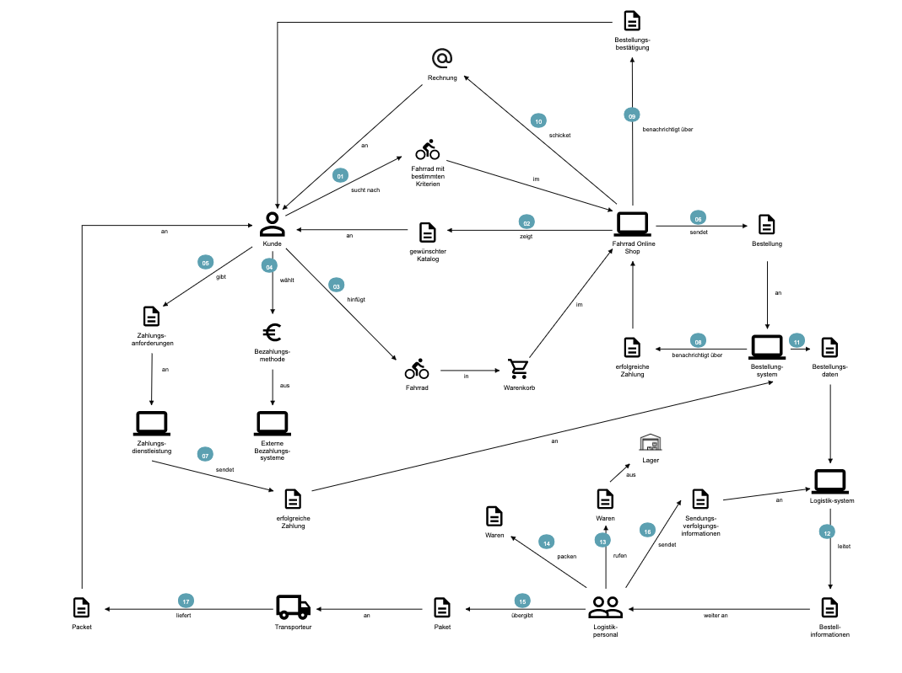
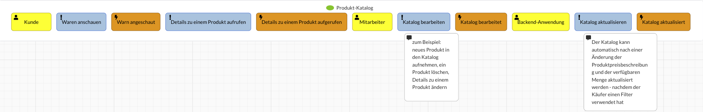
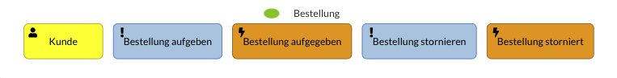

# Fahrradshop Website - Meilenstein 1 

_PTI09420 -Projekt Softwaretechnologie SoSe23- Westsächsische Hoschule Zwickau_

**Projektteam-Mitglieder**     
- Amal Chaouite   
- Ayoub El Kendi  
- Christian Spitzer    

## Inhalt
- Domain Storytelling 
- Event Storming mit Bounded Context
- Context Map
- Event Modelling
- Core Domains
- Aggregates
- Specification By Example - Use Cases

## Domain Storytelling

## Event Storming mit Bounded Context

![Warenkorb_Context]
#### Produkt-Katalog

#### Bestellung

#### Zahlung

#### Logistik

#### Lager

#### Lieferung

#### Rechnung
    

## Event Modelling

## Specification By Example - Use Cases

#### Szenario 1: Normal erfolgreich Durchlauf des Systems

#### Szenario 2: Artikel schon bezahlt, aber nach einer Störung das Fahrrad ist nicht mehr verfügbar

#### Szenario 3: Die für die Registrierung verwendete E-Mail ist ungültig

#### Szenario 4: Die vom Käufer eingegebenen Zahlungsdaten sind ungültig 

#### Szenario 5: Das Produkt entsprach nicht den Erwartungen des Käufers, was zu einer Rückgabeaufforderung führte 

## Bestellung context map

## Zahlung context map

## Logistik context map

## Produkt context map

## Liste aller Commands

**Bestellung microservice**
commands -> warenkorb
- CreateWarenkorbCommand
- AddProduktToWarenkorbCommand
- DeleteProduktFromWarenkorbCommand
- OrderWarenkorbCommand
- UnorderWarenkorbCommand

queries ->warenkorb
- FindWarenkoerbeQuery
- FindWarenkorbByIdQuery

commands -> bestellung
- CreateBestellungCommand
- CancelBestellungCommand
- UpdatePayedOrSentBestellungCommand

queries -> bestellung
- FindBestellungenQuery
- FindBestellungQuery

**Zahlung microservice**
commands:
- ProcessZahlungCommand
- CancelZahlungCommand

queries: 
- FindZahlungByBestellungIdQuery
- FindZahlungByIdQuery

**Logistik microservice**
commands: 
- CreateLogistikCommand
- CancelLogistikCommand
- SendShippingCommand

queries: 
- FindLogistikByIdQuery
- FindLogistikenQuery

**Katalog microservice**
commands: 
- CreateProduktCommand
- UpdateProduktCommand
- DeleteProduktCommand
- ReservationProduktCommand
- UnreserveProduktCommand

queries:
- FindProduktQuery
- FindAllProduktQuery

## BestellungSaga workflow
https://excalidraw.com/#json=Jy-NNb-sjufTpNMeDa9EU,Ilg4-os783eKRbVm-KSU_w

## Video
https://drive.google.com/file/d/16HYX4DtmDMmS7-v3BLHF4p4TgKB4XPPp/view?usp=sharing

**NOTE**
Nicht Funktionnierende Funktionen:
 - Docker-Compose Setup (Branch: Docker (95% Vollständig))
 - Keyclock (Branch: origin/Keyclock (85% Vollständig))
